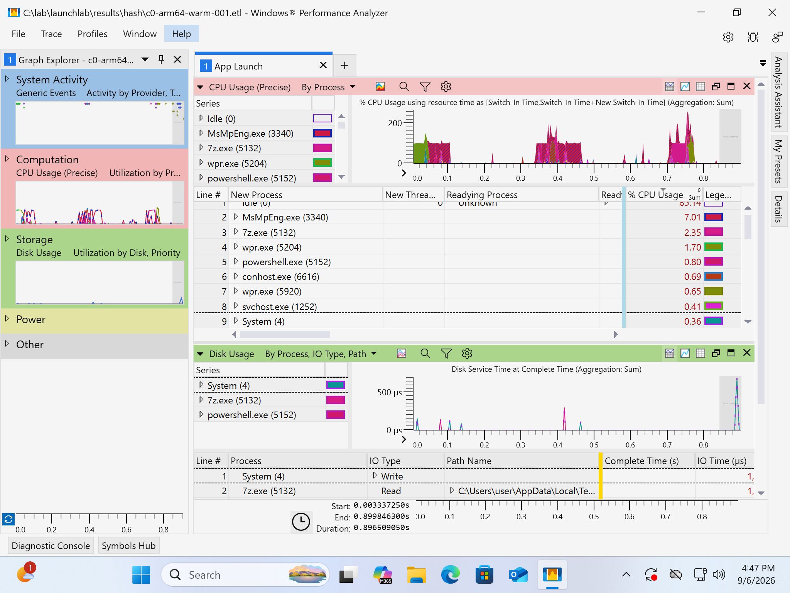

# LaunchLab

Measure Windows process-startup responsiveness with ETW, and say **where the time went** —
which module, which file, which process — instead of only how long it took.

In-box `wpr` records one trace per launch against a purpose-built profile. A .NET analyzer
built on the [TraceProcessing SDK](https://www.nuget.org/packages/Microsoft.Windows.EventTracing.Processing.All)
extracts per-run metrics from every trace. A report ranks the contributors and flags the
runs that were not like the others. A `compare` gate turns two runs into a pass/fail with an
exit code. And because an analyzer that agrees only with itself proves nothing, a `crossval`
step re-reads every trace with `wpaexporter` and `xperf` and diffs the two — **148 traces, five
metrics, agreement to the microsecond on four of them** (§9).

> **中文摘要**：用 Windows 內建的 `wpr` 錄下每一次啟動的 ETW trace，再用 TraceProcessing SDK
> 程式化地抽出「啟動耗時」與它的組成（實際佔用 CPU 的時間、排程等待、磁碟服務時間、硬缺頁），
> 交錯執行 A/B 以排除漂移，用中位數與 MAD 而非平均與標準差來偵測不穩定的量測。
> 再用微軟自己的 WPA (`wpaexporter`) 與 `xperf` 重讀同一批 trace 做交叉驗證：148 份 trace、
> 五個指標，其中四個逐微秒相符，不符的那一個也照實寫出來。
> 下面每一個數字都是這套工具實際跑出來的。

Everything below was measured with this harness, on two machines. The environment is disclosed
with every result, and `results/report.md` is generated, never hand-written.

---

## What was measured

Two machines, the same harness on both:

| | machine A (§1–§5, §7) | machine B (§6) |
|---|---|---|
| | Windows 11 Pro **ARM64** 26200.8037 | Windows 11 Pro **x64** 26200.9278 |
| | VMware Fusion guest on Apple silicon | physical, Ryzen 5 3600 |
| | 4 vCPU, 8 GB, SSD | 12 logical CPUs, 32 GB, SSD |
| CPU sampling | unavailable (no virtualised PMU) | available |
| arms | arm64 native vs x64 under Prism | x64 native vs x86 under WOW64 |

Defender real-time protection is **on** for every result below, and every environment fact the
report prints is recorded by the harness at capture time, not typed in afterwards.

**Workload:** 7-Zip 26.03 — two builds of the same release, invoked so that they start, print
usage, and exit. The build's target architecture is the only difference between the arms, and
the harness reads it out of the PE header rather than trusting the path.

**Metric:** `startup_ms` = process create → process exit, both timestamps taken from the
kernel process events inside the trace.

### 1. Emulating x64 costs ~15 ms per launch, and the number does not move

| batch | how stdout was captured | tracing | arm64 median | x64 median | Hodges–Lehmann shift |
|---|---|---|---:|---:|---:|
| 1 | temp file | every run | 9.6 ms | 25.1 ms | **+14.9 ms** |
| 2 | pipe | every run | 19.3 ms | 33.8 ms | **+14.6 ms** |
| 3 | pipe | every run | 20.8 ms | 36.3 ms | **+15.5 ms** |
| 4 | pipe | alternating | 18.8 ms | 33.9 ms | **+15.1 ms** |

n = 20 per arm per batch, interleaved A/B/A/B.

The absolute numbers move by 2× across batches — because how the harness captures the
workload's stdout changes what the workload pays, which is itself worth knowing. **The shift
does not**: four independent batches, two different capture mechanisms, two tracing cadences,
14.6–15.5 ms every time. That stability is the result; the absolute medians are not.

### 2. Nine tenths of that gap is time actually executing

Batch 3, medians, n = 20 per arm:

| | arm64 | x64 | Δ |
|---|---:|---:|---:|
| `startup_ms` | 20.8 | 36.3 | **+15.5** |
| `cpu_on_ms` — time on a processor | 10.3 | 24.2 | **+13.9** |
| `ready_ms` — runnable, not scheduled | 0.9 | 1.3 | +0.4 |
| images loaded | 17 | 18 | +1 |

`cpu_on_ms` comes from context-switch data, not from CPU sampling, so it is **exact and needs
no PMU** — which matters, because this machine has no PMU to offer (see §6). The emulation
tax is executing more instructions, not waiting more.

It is not attributable to a module here: that needs sampling, and this environment cannot
sample. The limit is stated rather than estimated.

### 3. The tax scales with how much x64 code runs

Same two binaries, given real work — hashing a fixed 32 MB file (n = 12 per arm):

| workload | arm64 | x64 | shift | `cpu_on_ms` Δ |
|---|---:|---:|---:|---:|
| start and exit | 20.8 ms | 36.3 ms | +15.5 ms | +13.9 ms |
| hash 32 MB | 29.8 ms | 58.9 ms | **+28.7 ms** | **+27.0 ms** |

Two points on the same binary separate a fixed startup tax from a per-work one. This is the
latter: double the executed code, roughly double the tax, with `cpu_on_ms` tracking the shift
at both volumes.

### 4. The obvious explanation is wrong: clearing the translation cache costs nothing

Prism caches its x64→ARM64 translations as `.JC` files in `C:\Windows\XtaCache`, so the
intuitive story is that a cold cache makes the first run expensive. It does not.

| comparison | baseline median | candidate median | shift | vs noise band | verdict |
|---|---:|---:|---:|---:|---|
| x64 warm → x64 cold cache | 33.8 ms | 33.4 ms | −0.8 ms | 1.7× | **PASS** |
| arm64 warm → arm64 cold cache *(control)* | 19.3 ms | 18.9 ms | −0.3 ms | 0.5× | PASS |

The control matters: it shows the act of stopping the service and clearing the directory is
itself neutral, so the null result is not the clearing cancelling the effect. `cpu_on_ms`
agrees — 24.2 ms warm against 24.0 ms cold.

**Why**, probed directly: clear the cache (0 files), run the x64 binary five times, wait, and
9 `.jc` files appear — `MSVCRT.DLL`, `KERNELBASE.DLL`, `GDI32.DLL`, `RPCRT4.DLL`,
`COMBASE.DLL`, `GDI32FULL.DLL`. All of them are the x64 **system DLLs** the process loads.
None is `7z.exe`. They are written **asynchronously by the XtaCache service after the run**,
so the launching process never waits for them, and a launch with a cold cache costs what a
launch with a warm one costs.

Corroborating this from the other direction, the wait attribution names `XtaCache.exe` as a
process that unblocks the measured thread — **only in the x64 arm** (1.6–3.2 ms median),
never in the arm64 arm. The emulation infrastructure is visible in the trace by name, without
any CPU sampling at all.

### 5. The most expensive thing in the experiment was idleness

Trying to price the recorder produced a *negative* overhead — untraced runs were 2–3× slower
than traced ones — in both a batched design and one that alternated tracing run by run. That
is not an observer effect, so the instrument was checked instead of the hypothesis
(wall-clock on both sides, same clock, same code path). n = 15 per arm:

| | arm64 | x64 |
|---|---:|---:|
| traced, 2 s between runs | 20.0 ms | 35.8 ms |
| **untraced, 0 s between runs** | **19.8 ms** | **35.3 ms** |
| untraced, 2 s between runs | 55.8 ms | 78.6 ms |

**Recording with this profile costs essentially nothing** (19.8 → 20.0 ms). What costs 36–43 ms
is letting the machine sit idle for two seconds first. The recorder's own work between runs
kept the processor busy and hid the wake-up cost — which is exactly why a traced batch cannot
be compared against an untraced one.

The settle time added *for* measurement rigour was the largest single confound in the
experiment, and it is more than twice the effect under study. Interleaving is what saves the
comparison: every arm pays the same idle.

### 6. The same method on a second machine finds a second, smaller translation tax

**Machine:** Windows 11 Pro x64, build 26200.9278, on a Ryzen 5 3600 — 12 logical CPUs,
32 GB, SSD, Defender real-time protection **on**, AMD Ryzen High Performance power plan.
Physical, not a guest: the harness records `virtual_machine: false` while still reporting
`hypervisor_present: true` — the two are not the same claim, and a hypervisor running under a
physical Windows install is worth disclosing rather than flattening into "bare metal".
**Workload:** the same 7-Zip 26.03 release — the x64 build against the 32-bit x86 build,
which runs under WOW64. Same harness, same metric, n = 20 per arm, interleaved.

| | arm64 vs x64-on-Arm (VM, Prism) | x64 vs x86-on-x64 (physical, WOW64) |
|---|---:|---:|
| baseline median | 20.8 ms | 18.2 ms |
| translated median | 36.3 ms | 20.6 ms |
| Hodges–Lehmann shift | **+15.5 ms** | **+2.5 ms** |
| MAD of the baseline arm | 1.3 ms | **0.6 ms** |
| CV of the baseline arm | 28.6 % | **8.7 %** |

Two things fall out. The tax is real on both machines but an order of magnitude apart —
whole-instruction-set emulation costs about six times what a 32-bit syscall thunk costs.
And **the virtual machine's noise floor is roughly twice the physical machine's**, which is
the more useful number: on the VM a 2.5 ms effect would have sat inside the MAD and been
unmeasurable. The measurement environment decides what effects are visible at all.

This machine has a PMU, so `wpr` accepted the sampling profile (`cpu_sampling: true`) and
the CPU-by-module breakdown §7 could not produce on the VM is available here:

| module | x64 median cpu ms | x86 median cpu ms | Δ |
|---|---:|---:|---:|
| `ntoskrnl.exe` | 4.6 | 6.5 | **+2.0** |
| `ntdll.dll` | 1.5 | 3.0 | **+1.6** |

`wow64.dll` shows up only in the x86 arm, as it must — but it is **not** where the time goes.
The cost is in the kernel and in `ntdll`, i.e. the syscall thunk path plus the extra loader
work: the x86 arm maps 22 images where the x64 arm maps 16. Sampling at 1 kHz over ~10 ms of
CPU quantises each module to about ±1 ms, so these rank contributors rather than price them.

Having a PMU also lets the two CPU measurements check each other. `cpu_on_ms` is exact and
comes from context switches; `cpu_ms` is statistical and comes from sampling:

| batch | config | `cpu_on_ms` (context switches) | `cpu_ms` (PMU sampling) | difference |
|---|---|---:|---:|---:|
| 20 ms launch | x64 | 8.8 | 7.9 | 0.9 |
| 20 ms launch | x86 | 11.6 | 11.0 | 0.6 |
| 35 ms hash | x64 | 24.9 | 24.2 | 0.7 |
| 35 ms hash | x86 | 28.0 | 28.0 | 0.0 |

They converge as the workload lengthens, which is what sampling error is supposed to do.
That is the check that `cpu_on_ms` — the metric §2's decomposition rests on, and the one
WPA would not export (§9) — measures what it claims to.

### 7. The harness knows what the machine cannot measure

`wpr -start` fails with `0x80070032` for any profile containing `SampledProfile` on this
guest — no PMU is exposed, so `GeneralProfile`, `CPU`, `Registry`, `Minifilter` and `Power`
are all unavailable, while `ProcessThread`, `Loader`, `CSwitch`, `ReadyThread`, `HardFaults`
and `DiskIO` work.

The same suite cannot assume the same instruments exist on every device. So the harness probes
what the machine will accept, degrades to `launchlab-nosampling.wprp`, records
`cpu_sampling: false` in `env.json`, and the report **says the CPU-by-module breakdown is
absent rather than printing an empty table that reads like "no CPU was used"**. A run is
marked with what it could measure, so an analysis never silently compares a sampled run
against an unsampled one.

### 8. Does the analyzer actually work? A known cost, injected and recovered

The harness measures itself: `spike` injects a **known** cost *inside the measured process* —
work done by the runner would be charged to the runner and correctly ignored, so the check
would pass by measuring nothing. Injected: 120 ms of CPU spin plus a 32 MB write flushed to
the device. n = 12 per arm.

| | baseline | injected | Δ |
|---|---:|---:|---:|
| `startup_ms` | 38.9 ms | 192.0 ms | **+153.1** |
| `cpu_on_ms` | 33.2 ms | 175.1 ms | **+141.9** |
| `disk_service_ms` | 0.0 ms | 10.6 ms | **+10.6** |
| disk I/Os | 0 | 43 | +43 |

The gate called it at **310× the baseline noise band**, ~93% of the cost landed in on-CPU
time where the spin was, and the disk half was attributed by name to `C:\lab\spike.bin`
(10.3 ms) — the exact file written. Both injected costs stayed separable.

### 9. Do the numbers agree with WPA? 148 traces say yes, and name the one place they don't

An analyzer that agrees only with itself proves nothing. `scripts/crossval.ps1` re-reads every
trace with two independent Microsoft implementations and diffs the result against `runs.csv`:

- **`wpaexporter.exe`** — WPA's own analysis engine, driven from the command line. Supplies
  Ready, Waits, disk service time and bytes.
- **`xperf.exe -a process`** — supplies process start and end, which is exactly what
  `startup_ms` is.

Nothing re-runs the workload. All three readers parse identical bytes, so a disagreement is an
analysis bug, not measurement noise.

| metric | compared against | traces | exact (≤ 1 µs) | largest disagreement |
|---|---|---:|---:|---:|
| `startup_ms` | `xperf -a process` | 148 | **148** | 0.001 ms (rounding) |
| `ready_ms` | WPA CPU Usage (Precise) | 148 | **148** | 0.001 ms (rounding) |
| `disk_service_ms` | WPA Disk Usage | 148 | **148** | 0 |
| `disk_mb` | WPA Disk Usage | 148 | **148** | 0 |
| `wait_ms` | WPA CPU Usage (Precise) | 148 | 139 | **2.72 ms** |

Five batches across both machines; per-run pairs are in `results/*/crossval.csv`.

**The first two bugs it found were mine, in the comparison itself.** `xperf` right-aligns the
pid inside the parentheses — `7z.exe ( 512)` — so a substring match on `(512)` silently missed
every process with a pid under four digits, and one run looked like a 20 ms disagreement when
it was a 0 ms one. And WPA's Disk Usage table groups rows by (process, IO type, path), so its
row count is not an IO count; comparing it against `disk_ios` was comparing two different
things. Both are fixed, and both are the reason the table above reports what it does.

**The one that is still open.** `wait_ms` differs on 9 of 148 runs: six by 5–9 µs, and three by
0.54, 2.60 and 2.72 ms. What has been ruled out, in order:

- *Not a missing context switch.* WPA counts 26 switch-ins for the worst run; so does the
  analyzer. Both see the same set of events and disagree on the sum.
- *Not the trace time range.* Re-exporting with `wpaexporter -range` clipped to the process
  lifetime leaves WPA's `Waits` byte-identical, so it is not a windowing difference.
- *Not an unresolved process association.* Falling back to the thread's process for activities
  whose own process is null changes nothing; the diagnostic count of unknown waits does not
  track the disagreement either.
- *Not compensated by `ready_ms`.* Ready matches to the microsecond on the same runs, so the
  time has not simply moved between two buckets.

That leaves a single wait interval that the two implementations anchor differently. It is 0.4 %
of one metric on 2 % of runs and it is written down here rather than rounded away, because a
cross-check whose disagreements go unreported is not a cross-check.

**What WPA would not give.** `cpu_on_ms` has no counterpart in this table. WPA's equivalent
column exists — "CPU Usage (in view)" in the CPU Usage (Precise) table — but it is hidden in the
stock preset, and `wpaexporter` uses a `.wpaProfile` only to choose *which tables* to export,
falling back to each table's built-in preset for the columns regardless of what the profile
says. The other table that does expose CPU time in milliseconds resolves stacks and takes
minutes per trace. So `cpu_on_ms` is validated the other way instead — against PMU sampling on
the physical machine, in §6.

`scripts/make-crossval-profile.ps1` derives the export profile by trimming the `AppLaunch`
profile that ships in the ADK catalog, rather than hand-authoring WPA's serialized view state.
The same profile opens in the WPA GUI, on the same trace:



---

## How it works

```
scripts/run.ps1            per run: set cache state, wpr -start, launch, wpr -stop
  └── results/*.etl        one trace per launch, plus a sidecar naming config/run/pid
launchlab analyze <dir>    ETL -> runs.csv (one row per run) + attrib.csv (long-form)
launchlab report  <dir>    -> report.md + summary.json
launchlab compare a.csv b.csv   regression gate, exit code 0 or 1
launchlab spike            negative-control workload
scripts/crossval.ps1 <dir> re-read the same ETLs with wpaexporter + xperf -> crossval.csv
```

Per run, `runs.csv` carries `startup_ms`, `wall_ms`, `cpu_on_ms`, `cpu_ms`, `ready_ms`,
`wait_ms`, `disk_service_ms`, `disk_ios`, `disk_mb`, `hardfaults`, `hardfault_io_ms`,
`images_loaded` and `disk_qd_median`.

`attrib.csv` names the participants, because "disk cost 200 ms" is not something an owner can
act on and "200 ms of it was reading *this file*" is:

| kind | key | answers |
|---|---|---|
| `module` | image name | which module burned the CPU (needs sampling) |
| `disk_read_file` / `disk_write_file` | file path | which file the storage time went to |
| `hardfault_file` | file path | what was being paged in |
| `readying` | process image | who unblocked the waiting thread — WPA's Wait Analysis, in code |

Module attribution uses `ICpuSample.Image`, the image of the sampled instruction, so it needs
**no symbol server and no PDBs**. Function-level analysis is what WPA is for.

**What `startup_ms` does not cover:** GUI first frame or input readiness. A run-to-exit
console workload makes the whole measurement *be* process startup — loader, DLL mapping,
page faults, first execution of the code — with no custom instrumentation needed to detect
"the window is ready". A GUI-ready metric needs a marker written into the trace.

**Components overlap and are summed across threads.** Disk service time is served while a
thread waits; `wait_ms` on a multi-threaded workload can exceed the wall-clock `startup_ms`.
They rank contributors. They are not a budget, and the report says so where the numbers are.

## Methodology

- **Interleaved A/B/A/B**, never one config in a block. Thermal drift, background work, host
  load and — as §5 shows — idle state then hit every arm equally.
- **Median and MAD, not mean and σ.** One 3× run poisons a standard deviation, and startup
  measurements always have one.
- **A flaky run must clear two bars**: more than 3 MAD from its config median *and* more than
  10% off it. On a tight distribution 3 MAD is a fraction of a millisecond, which flagged a
  third of a healthy run set until the second bar was added.
- **Hodges–Lehmann shift** for A/B, so the comparison does not assume normality.
- **The gate scales by the baseline's own noise**, `1.4826 × MAD`, not by a standard
  deviation — for the same reason.
- **Two independent clocks.** Every run is also timed by the harness stopwatch; the report
  prints it beside the trace-derived time. A gap means the analyzer is measuring the wrong thing.
- **The harness adds no I/O to its subject.** An early version redirected the workload's
  stdout to a temp file — and those writes showed up in the workload's own disk attribution.
  Output goes through pipes now.
- **Refuse invalid designs rather than produce misleading numbers.** `coldxta` clears a
  machine-wide cache, so the runner refuses to interleave it with a warm arm; compare the two
  batches with `compare` instead.
- **Environment is disclosed, not tidied up.** `env.json` records OS build and UBR, CPU, RAM,
  hypervisor, disk media, AC/battery, Defender state, power plan, the recording profile
  actually used, and the PE machine type of every workload binary. Defender stayed on.

## Quick start

Windows 10/11, .NET 8 SDK, elevated PowerShell (`wpr` requires it). No ADK needed to collect —
`wpr.exe` ships in Windows.

```powershell
# Collect: 20 launches of each binary, interleaved
.\scripts\run.ps1 -Apps 'arm64=C:\7z-arm64\7z.exe','x64=C:\7z-x64\7z.exe' -Mode warm -N 20

dotnet run --project src\LaunchLab -- analyze results\warm
dotnet run --project src\LaunchLab -- report  results\warm

# Regression gate: exit code 0 = within the baseline's noise, 1 = regression
dotnet run --project src\LaunchLab -- compare baseline\runs.csv candidate\runs.csv

# Statistics self-check, no test framework
dotnet run --project src\LaunchLab -- selftest
```

`-Mode coldfile` copies the application fresh per run; `-Mode coldxta` clears the Prism
translation cache per run; `-NoTrace` runs without the recorder; `-AlternateTracing` traces
every other run.

To check the analyzer against Microsoft's own tools on the traces you just collected (§9), the
Windows Performance Toolkit has to be installed — it is the one step that needs the ADK:

```powershell
# One-time: the toolkit, without the rest of the ADK
adksetup.exe /features OptionId.WindowsPerformanceToolkit /quiet /ceip off

# Re-read every trace with wpaexporter and xperf, diff against runs.csv
.\scripts\crossval.ps1 -ResultsDir .\results\warm
```

That writes `crossval.csv` next to `runs.csv` and prints the per-metric agreement table.

## Known limitations

- `startup_ms` measures a run-to-exit console workload, not GUI readiness.
- Components overlap and are summed across threads; treat them as a ranking.
- Absolute values belong to the machine and the session that produced them — §1 shows they
  move with the harness's own choices, and §6 shows the noise floor differs twofold between
  the two machines. Compare arms measured together; never absolute numbers across machines.
- CPU-by-module needs a PMU, so it exists for machine B and not for machine A (§7). The Prism
  emulation tax is therefore quantified and decomposed by scheduling state, but not attributed
  to a module. That needs physical ARM64 hardware, which this project does not have.
- `wait_ms` disagrees with WPA on 9 of 148 traces, three of them by more than half a
  millisecond, and the cause is not yet identified (§9).
- Not yet done: boot-trace analysis (`wpr -boottrace`), and a WPA add-in built on
  `Microsoft.Performance.SDK`.

## Layout

```
scripts/run.ps1                    scenario runner: cache state, wpr, one ETL + sidecar per run
scripts/launchlab.wprp             recording profile: only the keywords the analyzer reads
scripts/launchlab-nosampling.wprp  fallback for machines that cannot sample the CPU
scripts/crossval.ps1               re-read the traces with wpaexporter + xperf, diff the result
scripts/make-crossval-profile.ps1  derive the export profile from the ADK's AppLaunch profile
src/LaunchLab/
  Analyze.cs   ETL -> per-run metrics and attribution (TraceProcessing SDK)
  Stats.cs     median, MAD, p95, CV, Hodges-Lehmann, outlier detection, self-check
  Report.cs    runs.csv + attrib.csv -> report.md + summary.json
  Compare.cs   regression gate with an exit code
  Spike.cs     negative-control workload
docs/plans/                        the staged build plan this repo follows
docs/img/                          the WPA screenshot referenced from §9
```
